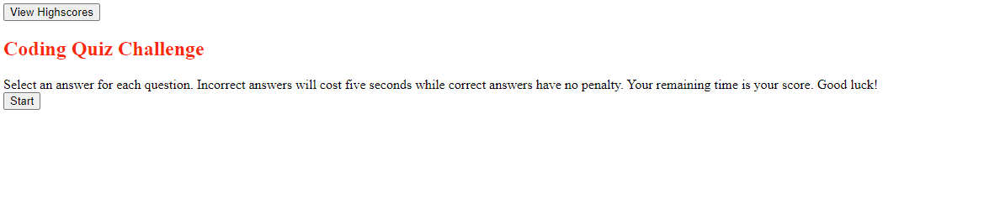

# Module 4 Challenge

## Deployed Link
https://zserrano.github.io/code-quiz/

## Screenshot of Deployed Website

## Description
Created a functioning code quiz that runs through a set of code-related questions and moves on to a new question once an answer is chosen.  

## Process
- Created html and css pages to hold the basic layout of the homepage and each quiz section to follow
- Javascript page holds necessary script and executes methods to move to the next part of the quiz as an answer is selected
- Start button begins quiz with no errors

## Contributors
- Zach Serrano (myself)

## Technologies Used
- HTML
- CSS
- Javascript
